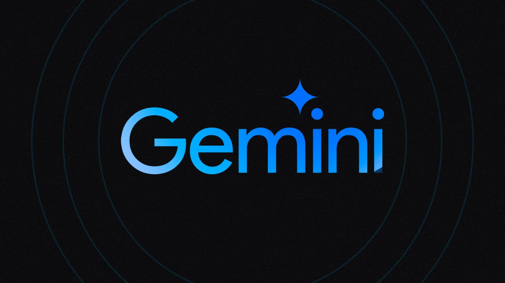

    

   

-------
 

# 👨‍💻 Imersão IA 2º edição - Gemini, a IA do Google

 > ℹ️ **NOTE:** Este repositório contém desafios propostos na imersão Gemini AI da plataforma [ALURA](https://cursos.alura.com.br/imersao).

# 👨‍💻 Aula 1 Mergulhando no Gemini, a IA do Google

Desafios da aula desta aula:

    1 - Use o Gemini ou o Google AI Studio para algo do seu dia a dia no trabalho, visando a automação de alguns processos já realizados por você

    2 - Pegue o seu histórico do Google Chrome por meio dessa extensão e peça para o Gemini tirar conclusões de como você tem usado o seu tempo, criando um resumo do que você mais acessa, quantidade de uso e tipo de site

Sobre o tema do trabalho, foquei em obter detalhes sobre a ferramenta do Gemini e em carreira, busquei primeiro identificar quais as diferenças e funcionalidades a versão paga do Geminini poderiam agregar, e como ela poderia me ajudar em minha jornada para se tornar um Especialista em Qualidade de Software.

## 📖 Página de inscrição:

- <a href="https://www.alura.com.br/imersao-ia-google-gemini"> 📕 Clique aqui para se inscrever</a>

## 💻 Tecnologias e ferramentas utilizadas no projeto

- [Gemini](https://gemini.google.com/app) 
- [AI Studio](https://aistudio.google.com)
- [Kaggle](https://www.kaggle.com/)

## 🧠 Prompts

Gemini AI：

|   Ação   | prompt |
| 1 - Use o Gemini ou o Google AI Studio para algo do seu dia a dia no trabalho, visando a automação de alguns processos já realizados por você. | Atue como um especialista em inteligência artificial faça uma tabela comparando as funcionalidades do Gemini e Gemini advanced e me explique em formato de texto tecnicamente as vantagens em assinar o Gemini Advanced e como isso pode me auxiliar no meu trabalho como analista de qualidade de software e na minha trajetória em busca de me tornar um especialista em qualidade de software.|

## 🤖 Conteúdo

    Comparação Detalhada entre Gemini e Gemini Advanced para Analistas de Qualidade de Software                                                        

    Introdução: Como Analista de Qualidade de Software em busca da excelência, você sabe que a inteligência artificial (IA) pode ser um aliado poderoso na sua jornada. As ferramentas Gemini e Gemini Advanced do Google oferecem recursos inovadores para te auxiliar na busca por qualidade impecável.

    Tabela Comparativa Detalhada
    | Funcionalidade        | Gemini                                    | Gemini Advanced                                                                  |
    |-----------------------|-------------------------------------------|----------------------------------------------------------------------------------|
    | Acesso à IA           | Básico                                    | Avançado                                                                         |
    | Modelos de IA         | Limitados                                 | Ampla variedade, incluindo modelos especializados em testes de software          |
    | Personalização        | Opções limitadas                          | Altamente personalizável para suas necessidades específicas de QA                |
    | Automação de Testes   | Suporte básico                            | Automação robusta de testes funcionais, de regressão e de UI                     |
    | Análise de Defeitos   | Identificação básica de defeitos          | Análise avançada de defeitos com sugestões de correção e priorização inteligente |
    | Geração de Relatórios | Relatórios simples                        | Relatórios detalhados e personalizáveis com visualizações de dados avançadas     |
    | Integrações           | Integrações básicas com ferramentas de QA | Integrações com diversas ferramentas de QA, DevOps e gerenciamento de projetos   |
    | Suporte               | Suporte padrão do Google                  | Suporte prioritário com acesso a especialistas em IA para QA                     |
    | Preço                 | Gratuito                                  | Plano pago com opções flexíveis                                                  |

    Vantagens Exclusivas do Gemini Advanced para Analistas de QA:

    Modelos de IA Especializados em Testes de Software: Acelere a criação e execução de testes com modelos pré-treinados para cenários comuns de QA, como testes de funcionalidade, regressão e UI.
    Automação Robusta de Testes: Libere tempo para tarefas mais estratégicas automatizando testes repetitivos e demorados. O Gemini Advanced permite a criação de scripts de teste personalizados e a integração com ferramentas de automação de teste líderes do mercado.
    Análise Avançada de Defeitos: Obtenha insights mais profundos sobre os defeitos com análise de causa raiz, sugestões de correção e priorização inteligente. Isso te ajuda a resolver problemas com mais rapidez e eficiência.
    Relatórios Detalhados e Personalizáveis: Crie relatórios personalizados com visualizações de dados avançadas para acompanhar o progresso da sua equipe de QA e identificar áreas para melhorias.
    Integrações Abrangentes: O Gemini Advanced se integra com diversas ferramentas de QA, DevOps e gerenciamento de projetos, centralizando suas informações e otimizando seu fluxo de trabalho.
    Suporte Prioritário com Especialistas em IA para QA: Tenha acesso a especialistas em IA para QA que podem te ajudar a tirar o máximo proveito da plataforma e resolver problemas técnicos específicos.

    Benefícios para Sua Trajetória como Especialista em Qualidade de Software:

    Aumento da Produtividade: Automatize tarefas manuais e tediosas, liberando tempo para atividades mais estratégicas que contribuem para o seu crescimento profissional.
    Melhoria na Qualidade do Software: Identifique e corrija defeitos com mais rapidez e precisão, garantindo a entrega de software de alta qualidade.
    Tomada de Decisões Baseada em Dados: Obtenha insights acionáveis a partir de relatórios detalhados e visualizações de dados, permitindo que você tome decisões mais informadas e estratégicas.
    Diferenciação no Mercado: Domine ferramentas inovadoras de IA e demonstre suas habilidades avançadas para se destacar no mercado de trabalho.
    Aceleração da sua Carreira: Torne-se um especialista requisitado em QA com as habilidades e conhecimentos mais procurados pelas empresas.

    Conclusão

    O Gemini Advanced é uma ferramenta poderosa que pode transformar a forma como você trabalha como Analista de Qualidade de Software. Com seus recursos avançados de IA, automação e análise, você pode aumentar sua produtividade, melhorar a qualidade do software e se destacar em sua carreira. Se você está buscando excelência em QA e deseja se tornar um especialista requisitado, o Gemini Advanced é um investimento que vale a pena. |

Gemini AI：

|   Ação   | prompt |

| Tente utilizar a analise de sentimento dos usuários usando a base de dados do Kaggle | Tenho 5 avaliações de hotéis. Quero que você analise o sentimento de cada uma delas, e dê uma nota de 1 a 5, sendo que a nota 5 é o sentimento mais positivo e 1 o mais negativo.

    nice hotel expensive parking got good deal stay hotel anniversary, arrived late evening took advice previous reviews did valet parking, check quick easy, little disappointed non-existent view room room clean nice size, bed comfortable woke stiff neck high pillows, not soundproof like heard music room night morning loud bangs doors opening closing hear people talking hallway, maybe just noisy neighbors, aveda bath products nice, did not goldfish stay nice touch taken advantage staying longer, location great walking distance shopping, overall nice experience having pay 40 parking night.

    -------------------------------------------------

    unique, great stay, wonderful time hotel monaco, location excellent short stroll main downtown shopping area, pet friendly room showed no signs animal hair smells, monaco suite sleeping area big striped curtains pulled closed nice touch felt cosy, goldfish named brandi enjoyed, did n't partake free wine coffee/tea service lobby thought great feature, great staff friendly, free wireless internet hotel worked suite 2 laptops, decor lovely eclectic mix pattens color palatte, animal print bathrobes feel like rock stars, nice did n't look like sterile chain hotel hotel personality excellent stay.

    -------------------------------------------------

    cozy stay rainy city, husband spent 7 nights monaco early january 2008. business trip chance come ride.we booked monte carlo suite proved comfortable longish stay, room 905 located street building, street noise not problem view interesting rooms building look dank alley midsection large office building, suite comfortable plenty room spread, bathroom attractive squeaky clean small comparison generous proportions sitting sleeping areas, lots comfortable seating options good lighting plenty storage clothing luggage, hotel staff friendly efficient, housekeeping staff did great job pleasant, requests responded quickly.the location quite good, easy walk pike street market seattle art museum notch shopping dining options.a positive experience.

    -------------------------------------------------

    excellent stayed hotel monaco past w/e delight, reception staff friendly professional room smart comfortable bed, particularly liked reception small dog received staff guests spoke loved, mild negative distance uphill ppmarket restaurants 1st, overall great experience

    -------------------------------------------------

    poor value stayed monaco seattle july, nice hotel priced 100- 150 night not, hotel takes beating quotient, experience simply average, nothing exceptional paying 300+ n't ca n't terribly disappointed, wife stayed nicest suites 200/night felt like overpaying, best advice shop, quality-wise league average marriott nice best western.|

## 🤖 Conteúdo

    Análise de Sentimento dos Reviews do Hotel Monaco Seattle:
    Review 1: 3/5

    Sentimento misto: elogia o hotel, localização e limpeza, mas critica o estacionamento caro, barulho no quarto e falta da peixinha dourada.

    Review 2: 5/5

    Sentimento positivo: destaca a localização, limpeza, aceitação de pets, decoração, amenidades, equipe e internet.

    Review 3: 4/5

    Sentimento positivo: ressalta o conforto da suíte, limpeza, equipe, localização e opções de lazer. Pontos negativos: barulho da rua (apenas para um quarto específico) e distância até o mercado.

    Review 4: 4/5

    Sentimento positivo: elogia a equipe, cama, recepção a pets, porém cita uma leve inclinação como ponto negativo.

    Review 5: 2/5

    Sentimento negativo: considera o custo-benefício ruim. Apesar de achar o hotel agradável, acredita que o preço não condiz com a qualidade oferecida.

    Resumo:

    O Hotel Monaco Seattle possui avaliações em sua maioria positivas, destacando-se a localização, limpeza, equipe e decoração. Alguns hóspedes reclamaram do preço do estacionamento, barulho em alguns quartos e     custo-benefício.

AI Studio：

|  Ação  | prompt |
| 2 - Pegue o seu histórico do Google Chrome por meio dessa extensão e peça para o Gemini tirar conclusões de como você tem usado o seu tempo, criando um resumo do que você mais acessa, quantidade de uso e tipo de site | Analise o meu histórico de navegação e liste os 10 sites que eu mais acessei, o tipo de site ,quanto tempo passei em média neles, e qual tem sido meu foco de estudos na ultima semana: Como parametro passei meu histórico em CSV que não foi versionado|

## 🤖 Conteúdo

    Análise do Histórico de Navegação:
    
    Infelizmente, não consigo analisar o tempo gasto em cada site pois a informação não está disponível no arquivo data(2).xlsx. No entanto, posso fornecer uma lista dos 10 sites mais acessados, seus tipos e insights sobre seu possível foco de estudos na última semana.

    Top 10 Sites Mais Acessados:

    LinkedIn (linkedin.com): Rede social profissional - 56 visitas - Sugere um forte foco em networking, busca de emprego e desenvolvimento de carreira.

    Google (google.com): Motor de busca - 47 visitas - Indica pesquisas diversas, possivelmente relacionadas aos seus estudos e interesses.

    Instagram (instagram.com): Rede social de compartilhamento de fotos e vídeos - 33 visitas - Pode ser usado para entretenimento e conexão social, mas também para seguir perfis educativos ou profissionais.

    YouTube (youtube.com): Plataforma de compartilhamento de vídeos - 24 visitas - Possivelmente usado para assistir vídeos educativos, tutoriais, ou conteúdo relacionado aos seus estudos.

    Gemini (gemini.google.com): Interface do modelo de linguagem Gemini - 18 visitas - Demonstra um claro interesse em inteligência artificial e modelos de linguagem.

    Udemy (udemy.com): Plataforma de cursos online - 22 visitas - Reforça o interesse em aprendizado e desenvolvimento de habilidades.

    Kaggle (kaggle.com): Plataforma para ciência de dados e aprendizado de máquina - 14 visitas - Sugere um possível interesse em ciência de dados e machine learning.

    Google AI Studio (aistudio.google.com): Plataforma de desenvolvimento de IA - 14 visitas - Reforça o interesse em IA e pode indicar a criação de seus próprios projetos de IA.

    CodePen (codepen.io): Plataforma para desenvolvimento web - 12 visitas - Indica um possível interesse em desenvolvimento web ou front-end.

    GitHub (github.com): Plataforma de hospedagem de código-fonte - 18 visitas - Sugere um interesse em programação e desenvolvimento de software.

    Foco de Estudos na Última Semana:

    Com base na análise dos sites mais acessados, seu foco de estudos na última semana parece estar relacionado a:

    Inteligência Artificial (IA): Várias visitas ao Gemini, Google AI Studio e cursos da Udemy sugerem um interesse em IA, incluindo modelos de linguagem e desenvolvimento de projetos de IA.

    Ciência de Dados e Machine Learning: As visitas ao Kaggle indicam um possível interesse em explorar essas áreas relacionadas à IA.

    Desenvolvimento Web: CodePen pode ser usado para praticar habilidades de desenvolvimento web ou front-end.

    Programação e Desenvolvimento de Software: As visitas ao GitHub sugerem um interesse em programar e desenvolver software.

    Considerações Adicionais:

    Carreira e Networking: O alto número de visitas ao LinkedIn indica um possível foco em desenvolvimento de carreira, busca de emprego e networking.

    Aprendizado Contínuo: As visitas a plataformas de cursos online como Udemy mostram um compromisso com o aprendizado contínuo e o desenvolvimento de novas habilidades.

    Recomendações:

    Explore cursos e recursos online: Continue a explorar plataformas como Udemy, Kaggle e Google AI Studio para aprofundar seus conhecimentos em IA, ciência de dados e desenvolvimento web.

    Participe de comunidades online: Envolva-se em comunidades online como o fórum do Kaggle ou grupos do LinkedIn para conectar-se com outros profissionais e estudantes da área.

    Crie projetos pessoais: Coloque em prática o que você aprende criando projetos pessoais em IA, ciência de dados ou desenvolvimento web. Isso pode fortalecer seu portfólio e ajudá-lo a se destacar no mercado de trabalho.
    Espero que esta análise seja útil! |

## ✨ Features

- Conteúdo gerado via Gemini AI
- Conteúdo geradas via AI Studio

## 📚 Materiais

- Imagem da campanha em `assets`

## 👨‍💻 Expert

    
    
&nbsp&nbsp&nbspWilliam Rodrigues 
    &nbsp&nbsp&nbsp
    <a href="https://github.com/William-Rodrigues">
    GitHub</a>&nbsp;|&nbsp;
    <a href="https://www.linkedin.com/in/william-rodrigues-a4018069/">LinkedIn</a>

  

---